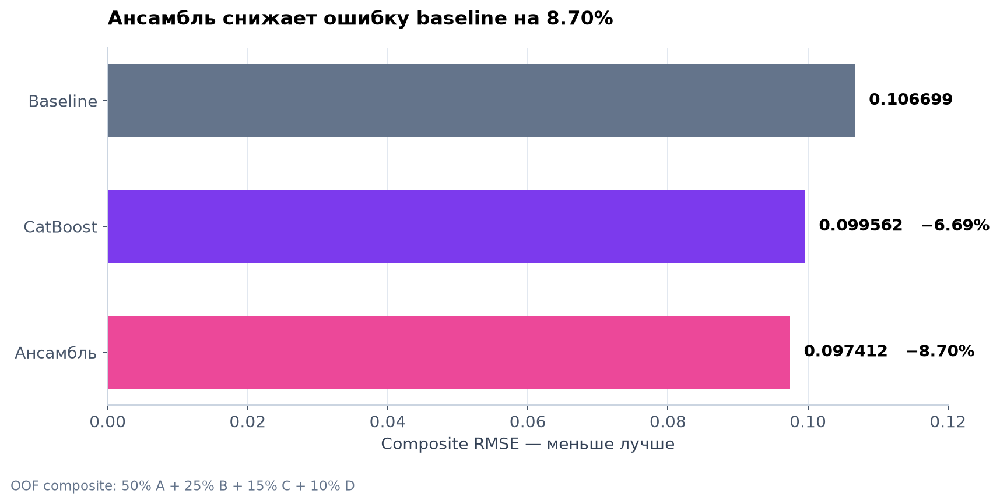
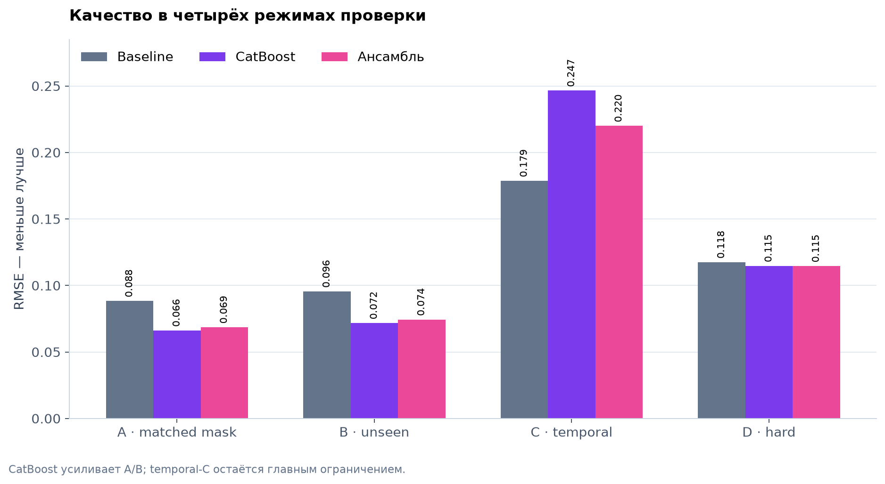

# Восстановление спутникового NDVI

Система восстанавливает пропуски в ежедневных рядах `primary_ndvi` для
сельскохозяйственных полигонов. Решение объединяет временной контекст,
наблюдения Sentinel-2, Landsat и MODIS, погодные признаки ERA5, тип культуры и
историю полигона. Один и тот же feature builder используется при проверке и
инференсе.

## Результат

На зафиксированной четырёхрежимной OOF-проверке ансамбль среднего соседних
наблюдений и CatBoost снизил composite RMSE с **0.106699 до 0.097412** — на
**8.70%** относительно baseline. На основном matched-mask сценарии CatBoost
получил **RMSE 0.066256** и **GapScore 10.12**.



| Модель | Composite RMSE | Изменение к baseline |
|---|---:|---:|
| Среднее соседей | 0.106699 | — |
| CatBoost | 0.099562 | −6.69% |
| Ансамбль | **0.097412** | **−8.70%** |

Итоговый ансамбль использует 30.955% baseline и 69.045% CatBoost. Вес выбран
только по OOF-предсказаниям и не использует скрытые ответы test или leaderboard.
Все шесть проверенных conditional gates отклонены по заранее заданным условиям;
clip целевой переменной не применялся.

## Данные и задача

| Набор | Строки | Полигоны | Период | Видимые `primary_ndvi` |
|---|---:|---:|---|---:|
| Train | 99 955 | 39 | 2010–2024 | 30 520 |
| Test | 57 185 | 78 | 2010–2025 | 17 641 |

В test требуется восстановить **3 112** искусственно скрытых точек. Только
14.91% из них относятся к знакомым полигонам, поэтому случайное разбиение строк
даёт слишком оптимистичную оценку. Для каждой скрытой строки маскируются target,
спутниковые и погодные поля, а календарные признаки восстанавливаются из даты.

Для всех 48 161 видимых значений подтверждена иерархия источника target:
Sentinel-2 → Landsat → MODIS. Источник скрытой точки заранее неизвестен, поэтому
его вероятности оценивает отдельный cross-fitted классификатор.

## Подход

1. Маска псевдопропусков повторяет долю новых полигонов, длины серий пропусков и
   сезонное распределение test.
2. Четыре режима CV проверяют matched-mask интерполяцию, новые полигоны,
   временной перенос и сложные разреженные случаи.
3. Feature builder создаёт 301 признак: соседние значения и расстояния,
   интерполяции, локальную динамику, доступность сенсоров, погоду, календарь и
   fit-only priors.
4. RandomForest оценивает вероятный источник `primary_ndvi`; CatBoost с
   нативными категориями восстанавливает значение.
5. Неотрицательные веса baseline и CatBoost выбираются по OOF. Эмпирические
   интервалы и диагностика качества возвращаются отдельно от submission.

## Четыре режима проверки



| Режим | Что проверяется | N | Baseline | CatBoost | Ансамбль |
|---|---|---:|---:|---:|---:|
| A | Маска, похожая на test | 6 000 | 0.088455 | **0.066256** | 0.068649 |
| B | Полностью новые полигоны | 6 000 | 0.095591 | **0.071849** | 0.074441 |
| C | Перенос на будущий сезон | 1 200 | **0.178772** | 0.246606 | 0.220068 |
| D | Длинные и односторонние пропуски | 117 | 0.117576 | 0.114809 | **0.114671** |

Composite RMSE рассчитывается с фиксированными весами A/B/C/D =
50%/25%/15%/10%. CatBoost заметно улучшает наиболее близкие к конкурсному test
режимы A и B, но хуже baseline переносится на будущий сезон C. Поэтому временной
сдвиг 2025 года остаётся главным риском, а результаты не выдаются за независимую
leaderboard-оценку.

## Надёжность результата

- 20 автоматических тестов проверяют схему, ключи, маскирование, отсутствие
  self-target leakage, grouped priors, детерминированность folds, feature parity,
  bundle hashes, fallback, API/CLI parity и строгий формат submission.
- Готовый submission содержит ровно 3 112 уникальных ключей, три обязательные
  колонки и только конечные предсказания.
- Для эмпирических интервалов получено pooled coverage 79.09% при nominal 80% и
  93.94% при nominal 95%. Из-за просадки отдельных folds интервалы помечены как
  оценочные, без заявления формальной калибровки.
- Первый полный GPU-цикл, включая подготовку 16 фолдов, OOF, importance,
  финальную модель и batch inference, занял 43 минуты.

## Проверка кода

```bash
python -m pip install -r configs/ml/requirements.txt
PYTHONPATH=src python -m unittest discover -s tests/ml -v
PYTHONPATH=src python artifacts/ml/evaluate_baselines.py
```

Графики перестраиваются из `reports/model_metrics.csv` командой
`python reports/build_metric_figures.py` после установки
`configs/ml/requirements-reporting.txt`.

Исходные CSV не изменяются. Тяжёлые обученные модели, рабочие кэши и переносимые
архивы не хранятся в Git; в отчётах остаются метрики, конфигурации, fingerprints
данных и SHA256 итогового submission.

## Структура

| Путь | Содержимое |
|---|---|
| `src/veg_recovery/data/` | чтение данных и проверки контракта |
| `src/veg_recovery/validation/` | маскирование, folds и метрики |
| `src/veg_recovery/features/` | единый leakage-safe feature builder |
| `src/veg_recovery/models/` | baselines, CatBoost, ансамбль и bundle |
| `src/veg_recovery/inference.py` | публичный Python API |
| `src/veg_recovery/cli/batch.py` | строгий batch inference |
| `tests/ml/` | контрактные, leakage и end-to-end тесты |
| `reports/` | результаты, сравнения и графики |

Подробности экспериментов: [исследовательский отчёт](reports/ml_ablation.md),
[журнал запусков](reports/experiments.csv),
[проблемы контракта данных](reports/data_contract_issues.md) и
[сводка метрик для графиков](reports/model_metrics.csv).

## DL-эксперимент: residual TCN и детекция аномалий

DL-часть — отдельный кандидат в ансамбль и владелец anomaly-подсистемы. Она
использует **те же** folds, MaskSpec и baseline OOF, что и ML: собственных
разбиений не создаёт. Внедрение возможно только через adoption gate;
production-путь работает без PyTorch.

| Путь | Содержимое |
|---|---|
| `src/veg_recovery/dl/` | window adapter, сезонный prior, TCN, runner, отчётность |
| `src/veg_recovery/dl/c03_bridge.py` | мост к опубликованным folds/MaskSpec ML |
| `src/veg_recovery/dl/expert.py` | DL за общим интерфейсом `NDVIReconstructor` |
| `src/veg_recovery/anomalies/` | `advanced/events/explain` поверх `ndvi_harmonized` |
| `configs/dl/kaggle/` | сборка Kaggle Dataset и notebook для GPU-прогона |
| `reports/dl_decision.md` | результаты, ограничения и решение по gate |

После слияния веток отдельный worktree ML не нужен — источник C-03 берётся
из этого же дерева:

```bash
PYTHONPATH=src python -m veg_recovery.dl.c03_bridge --ml-root . --output artifacts/dl/c03_derived
PYTHONPATH=src python -m veg_recovery.dl.train --fold-manifest artifacts/dl/c03_derived/dl_c03.json --preflight-only
PYTHONPATH=src python -m pytest -q tests/dl tests/anomalies
```

Статус задач и зависимостей команды: `00_team_coordination.md` в ветке `main`.
