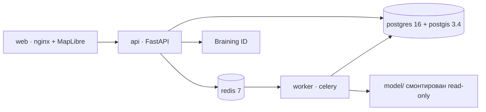

# cosmo_track — мониторинг вегетационной динамики

Космохакатон, кейс «Агропульс». Сервис показывает ряд NDVI по полю,
восстанавливает пропущенные значения `primary_ndvi` и отмечает периоды
негативных отклонений от сезонной нормы с объяснением на русском языке.

Демо-стенд: **https://braining.space** (TLS, вход по коду на почту через
Braining ID).

Репозиторий собирается из трёх частей, которые делались параллельно: веб-сервис
(ветка `backend`), ML-решение задачи восстановления (`ndvi2/` и поставка
`model/`) и DL-подсистема аномалий (ветка `DL`). Ниже описано и то, и другое,
с указанием, что именно сейчас работает в сервисе, а что лежит рядом как
исследование.

---

## Пользовательский путь

1. Вход по коду на почту. Своей аутентификации у сервиса нет: пароли, их сброс
   и защита от перебора отданы внешнему Braining ID, наружу из него доходит
   только подтверждённая личность, а сессию сервис выдаёт свою.
2. Карта на весь экран, схема OSM или спутниковая подложка. Поле можно
   нарисовать или выбрать из уже сохранённых.
3. Полю назначается ряд наблюдений из списка `GET /reference-polygons`.
4. Анализ запускается кнопкой и уходит в очередь. Фронт опрашивает
   `GET /jobs/{id}` и рисует стадии, а не выдуманные проценты.
5. Результат: график наблюдаемого и восстановленного NDVI, лента
   неопределённости, красные полосы негативных событий, карточка события
   с reason codes и погодным контекстом.

Важная честность интерфейса. Нарисованный контур сам по себе данных не несёт:
геометрий в конкурсных CSV нет, связать полигон с рядом автоматически
невозможно. Поэтому ряд выбирает человек из списка доступных, а `POST /analyses`
отвечает 422, если у поля нет привязки `properties.anon_polygon_id`. Создавать
заведомо падающую джобу незачем.

---

## Архитектура



`api` и `worker` собираются из одного `Dockerfile` и различаются только
командой: разъехавшиеся версии кода на двух сторонах очереди дают ошибки,
которые воспроизводятся только на стенде.

Анализ не выполняется внутри HTTP-запроса. `POST /analyses` возвращает 202 и
`job_id`, дальше работает Celery. Стадия хранится в БД, а не в памяти процесса,
поэтому упавший контейнер не превращает выполняющуюся джобу в вечный `QUEUED`.

```
QUEUED → FETCHING → PREPROCESSING → RECONSTRUCTING → ANALYZING → COMPLETED
             ↓
          PARTIAL → PREPROCESSING
```

`FAILED` достижим из любой рабочей стадии. `PARTIAL` не терминальна: источник
отдал неполный набор, анализ продолжается, результат помечается частичным.
Таблица переходов объявлена один раз в `apps/api/schemas/jobs.py` и оттуда же
читается воркером и контрактным тестом.

Повторный запрос с тем же `geometry_hash + date_range + pipeline_version` обязан
вернуть тот же `analysis_id` и не создавать вторую джобу.

### Схема данных

PostgreSQL с PostGIS, миграции Alembic (`create_all` в рабочем пути запрещён).
Таблицы: `users`, `sessions`, `polygons`, `analyses`, `analysis_jobs`,
`observations`, `reconstructions`, `anomaly_events`, `provenance`. Геометрия
хранится как `geometry(MultiPolygon, 4326)`, площадь считается в проекции, а не
в градусах. Отсутствующее наблюдение остаётся `NULL`: ноль в NDVI — это реальное
значение, и подменять им пропуск нельзя.

---

## Запуск

```bash
cp .env.example .env      # POSTGRES_PASSWORD обязателен, дефолтного пароля нет
docker compose up --build # web :8080, api :8000, документация на /docs
```

Переменные самого приложения читаются с префиксом `COSMO_`. Префикс не
косметика: без него `DATABASE_URL` или `CORS_ORIGINS` подхватывались бы из
окружения CI-раннера, и прогон переставал быть детерминированным.

Без Docker:

```bash
uv sync --extra web --extra core --extra ml --extra dev
uv run alembic upgrade head
uv run uvicorn apps.api.main:app --reload
uv run pytest -q                    # офлайн, сеть не нужна
```

Постгрес в compose открыт только на петлевом интерфейсе и на порту 55432:
штатный 5432 на машине разработчика часто занят локальной базой, и тогда тесты
молча уходят в чужую.

---

## API

Префикс `/api/v1`, health-роуты живут вне его: их дёргают healthcheck-и Compose,
и версия API не должна их двигать.

| Метод | Путь | Состояние |
|---|---|---|
| GET | `/health/live` `/health/ready` `/health/providers` | работают |
| POST | `/api/v1/auth/email-code` | запрос кода на почту |
| POST | `/api/v1/auth/session` | обмен кода на сессию |
| DELETE | `/api/v1/auth/session` | выход |
| GET | `/api/v1/auth/me` | текущий пользователь |
| GET POST | `/api/v1/polygons` | список и создание, 201 |
| GET DELETE | `/api/v1/polygons/{id}` | чтение и удаление, 204 |
| GET | `/api/v1/reference-polygons` | какие ряды доступны для анализа |
| POST | `/api/v1/analyses` | 202 и `job_id` |
| GET | `/api/v1/jobs/{id}` | стадия и прогресс |
| GET | `/api/v1/analyses/{id}` | сводка анализа |
| GET | `/api/v1/analyses/{id}/series` | ряд с качеством и климатологией |
| GET | `/api/v1/analyses/{id}/anomalies` | события и предупреждения |
| GET | `/api/v1/analyses/{id}/provenance` | происхождение данных |
| GET | `/api/v1/analyses/{id}/export.csv` | выгрузка ряда |
| POST | `/api/v1/field-search` | 501, живых провайдеров контуров нет |

Любой не-2xx ответ приходит в одном конверте:

```json
{"error_code": "VALIDATION_ERROR", "message": "…", "request_id": "8a9abc…"}
```

`request_id` совпадает с заголовком `x-request-id` и попадает в структурный лог.
Ни секретов, ни стека, ни эха присланного тела наружу не уходит.

Правила, которые видны в схемах и стоят объяснения:

- Тела запросов объявлены с `extra="forbid"`. Опечатка `dateFrom` даёт 422, а не
  молчаливый анализ за период по умолчанию.
- Сырой `primary_ndvi` и `ndvi_harmonized` — разные поля ряда, а не одно.
- `SeriesPoint` несёт `valid_pixel_fraction`, `pixel_count`, `qa_flags`,
  климатологию и погоду. Без них нечем наполнить подсказку графика и нечем
  подтвердить reason codes.
- `interval_coverage` объявляет номинальный уровень ленты. Подписывать её
  «точность 95 %» запрещено: это покрытие интервала, а не вероятность события.
- Метка кэша `cached` и `data_retrieved_at` стоит и в ряде, и в сводке анализа.
  Выдавать кэш за живой запрос нельзя, а требовать ради проверки отдельный
  запрос — значит гарантировать, что его забудут.
- Пустой список — валидное состояние, а не ошибка. «Аномалий нет» и «данных не
  хватило» показываются разными состояниями.

Живого сбора спутниковых данных нет. В `src/veg_recovery/providers/` лежит
единственный источник `fixture.py`, который отдаёт ряды из данных самой поставки
модели. Ключи внешних сервисов в `.env.example` — заготовка под будущие
адаптеры, а не работающий путь.

---

## Модель в сервисе

Предсказания считает пакет `model/`, смонтированный в контейнер только на
чтение. Это смесь LightGBM, LightGBM без донорских признаков и трёх спутниковых
экспертов CatBoost на 324 признаках.

| Компонент смеси | Вес |
|---|---:|
| LightGBM со всеми признаками | 5.5624 % |
| LightGBM без коррелирующих полей | 36.0531 % |
| Мягкая смесь трёх спутниковых экспертов | 58.3844 % |

Измерено на собственной групповой CV поставки: development RMSE **0.054305** на
3 492 точках, audit RMSE **0.056145** на 1 079 точках. Полусумма ближайших
соседей на тех же выборках — 0.091812 и 0.085485. Пересчёт audit в формулу
организаторов даёт 13.16 из 30 против 4.35 у baseline. Это локальная оценка,
официальный балл не измерялся.

Точность определения источника на четырёх фолдах — от 95.64 % до 98.18 %.
Источник неизвестных тестовых целей проверить не на чем.

Как пакет подключён и почему именно так:

- Каталог монтируется как есть и не копируется в образ. Поставка самодостаточна
  и хеширована `PACKAGE_MANIFEST.json`, а `ndvi.data.read_data` сверяет SHA256
  обоих CSV при каждом старте. Копия немедленно рассинхронизировалась бы с этими
  хешами, и проверка целостности превратилась бы в проверку копии.
- Модель нельзя вызвать «на произвольном кадре». Признаки строятся из всего
  набора: сезонная норма полигона, наблюдения других полей на ту же дату,
  донорские ряды. Набор грузится один раз на процесс воркера, запрос
  сопоставляется с ним по ключу `(anon_polygon_id, date)`.
- Точка, которой в наборе нет, не восстанавливается. Придумать ей контекст
  нельзя, а вернуть «примерно такое значение» — это выдумка, а не прогноз.
- Обученная смесь лежит в pickle, а pickle исполняет код при загрузке. Поэтому
  она поднимается только при `COSMO_MODEL_BUNDLE_TRUSTED=true`, и доверие
  включается после сверки хешей, а не «чтобы заработало».
- Готовой модель объявляется только при наличии кода, данных и обученного
  запуска. Пустая точка монтирования даёт `degraded`, отсутствующая —
  `not_configured`, и `/health/ready` говорит это прямо.
- Интервал эмпирический: q90 модуля ошибки на development, полуширина 0.07805,
  покрытие на audit 89.25 %. Это не conformal-интервал для зависимых рядов, и
  статус `empirical_q90_not_conformal` сообщает об этом явно.
- Гармонизацию эта модель не выполняет, она восстанавливает сырой конкурсный
  ряд. Колонка `ndvi_harmonized` заполняется значением как есть со статусом
  `not_applied`.

---

## Решение ML

Актуальная итерация лежит в `ndvi2/` вместе со скриптами запуска. Она точнее
поставленной в сервис и готовится ей на замену.

**Измеренный результат:** честная 5-фолдовая по полигонам оценка смеси —
RMSE **0.05039**, GapScore **14.88** на 4 599 контрольных строках,
воспроизводящих структуру теста. Полусумма соседей на тех же строках — 0.09048
и GapScore 2.86. Готовый `outputs/submission.csv` покрывает 2 323 официальных
контрольных ключа.

Скрытые ответы организаторов недоступны, серверная оценка не выполнялась.
Сравнивать 14.88 с 13.16 поставки напрямую нельзя: числа посчитаны на разных
контрольных выборках и разными протоколами.

### Данные

| Набор | Строки | Полигоны | Видимых `primary_ndvi` | Период |
|---|---:|---:|---:|---|
| train | 99 955 | 39 | 30 520 | 2010-04-01 — 2024-10-30 |
| test | 49 190 | 20 | 13 164 | 2010-04-01 — 2024-10-30 |

Пересечение полигонов пустое. Скрыто 2 323 значения, ровно 15 % от измеренных
значений тестовых полей: 2 132 одиночных пропуска, 94 двойных, 1 тройной.
На контрольной строке скрыты все динамические поля, включая три спутниковых
NDVI/EVI/NDWI, погоду ERA5 и `year`/`doy`. Год и день года пересчитываются
из даты.

### Что делает решение

`primary_ndvi` — первое доступное значение в порядке Sentinel-2 → Landsat →
MODIS. Проверено на всех 48 161 видимой цели с допуском 1e-7. Отсюда задача
распадается на две: определить сенсор и предсказать его значение.

1. **Календарь съёмки.** MODIS снимает строго при `(DOY−1) mod 16 == 0`,
   Landsat до 2021 года — ровно в 4 фазах из 16 по `t mod 16` на каждое поле,
   Sentinel-2 — в 2 фазах из 5. Это не статистика, а орбитальная механика: набор
   фаз поля постоянен внутри эпохи. Итоговая точность классификатора источника
   98.15 %.
2. **Гармонизация.** Landsat и MODIS приводятся к шкале S2 робастной аффинной
   калибровкой на синхронных парах, отдельно для каждого поля со сжатием
   к глобальной. По объединённому ряду строится робастная локальная квадратика.
3. **Общая по дате аномалия.** Остатки наблюдений всех остальных полей в ту же
   дату — это общая атмосфера. Корреляция с остатком целевого поля 0.34–0.48.
4. **Группы ERA5.** У 8 групп полей температура и осадки совпадают побитово на
   всех совместных датах. Это не доказывает соседство полей, только общую ячейку
   переанализа около 9 км, и используется для восстановления скрытой погоды
   контрольной строки и как приоритетный круг доноров.
5. **Смещение спутника по фазе орбиты.** Landsat 7/8/9 и разные пути дают
   систематически разное NDVI на одном поле, sd около 0.017. Оценивается по фазе
   с эмпирическим байесовским сжатием.
6. **Трансдуктивное обучение.** Видимые 13 164 значения тестовых полей — это
   данные условия, а не ответы. Они входят в обучающую выборку, и валидация
   воспроизводит ровно эту ситуацию.
7. **Смесь** шести регрессоров и трёх спутниковых экспертов с неотрицательными
   весами, подобранными на валидации.

### Структура

```
ndvi2/
  core.py        загрузка, схема, контекст с сокрытием строк, восстановление источника
  smooth.py      локальная полиномиальная регрессия, робастная версия (IRLS, бивес)
  features.py    280 признаков: календарь съёмки, гармонизация сенсоров,
                 общая по дате аномалия, смещение спутника по фазе орбиты,
                 климатология, погода из полей той же ячейки ERA5
  pipeline.py    группы ERA5, блочное маскирование, генерация обучающей выборки
  anomalies.py   робастная норма по прошлым годам, устойчивые события, reason codes
run_cv.py        сборка валидационного протокола
train3.py        классификатор источника, регрессоры и спутниковые эксперты
blend.py         неотрицательные веса смеси, честная оценка по полигонам
build_final.py   финальная обучающая выборка и матрица контрольных строк
submit.py        сборка и строгая проверка submission.csv
run_anomalies.py построение аномальных периодов по всем полям
```

### Воспроизведение

Python 3.11, `pip install pandas numpy scipy scikit-learn lightgbm catboost`.
Проверено на pandas 3.0.2, numpy 2.4.4, scikit-learn 1.8.0, lightgbm 4.7.0,
catboost 1.2.10. GPU не нужен, всё считается на двух ядрах CPU.

```bash
# 0. данные: data/train.csv, data/test.csv
python -c "from ndvi2.core import load_raw; load_raw('data/train.csv','data/test.csv').to_pickle('base.pkl')"

# 1. валидация: 15 % значений train-полигонов скрываются, обучающие примеры
#    порождаются блочным маскированием поверх этого контекста (5 раундов)
python run_cv.py --rounds 5 --out work/cv3

# 2. модели на валидации
for m in lgb_c experts lgb_e mlp lgb_d cat lgb_a2; do
  python train3.py --dir work/cv3 --models $m
done
python blend.py work/cv3          # веса смеси и честная 5-фолдовая оценка

# 3. финальное обучение на train и видимом test, предсказание 2 323 строк
python build_final.py --rounds 5 --out work/final
for m in lgb_c experts lgb_e mlp lgb_d cat lgb_a2; do
  python train3.py --dir work/final --models $m --final 1
done
python submit.py                  # outputs/submission.csv и строгая проверка формата

# 4. аномалии
python run_anomalies.py           # outputs/anomaly_events.csv
```

Каждая модель запускается отдельным процессом: пиковая память одного шага около
1.3 ГБ, все шаги вместе в один процесс не помещаются в 7 ГБ.

### Ограничение, которое важно назвать

Шум одного спутникового измерения на этих данных — σ около 0.05. Два наблюдения
Landsat с интервалом в сутки расходятся с RMSE 0.074 на 5 529 парах, S2 и
Landsat в одну дату — 0.068 на 3 329 парах. Восстанавливая скрытое значение,
модель обязана угадать конкретную реализацию атмосферного шума. Общая по дате
компонента уже исчерпана: корреляция остатка модели со средним остатком других
полей той же даты равна −0.007. RMSE ниже примерно 0.045–0.048 на этих данных
недостижим. Подробности и все проверенные гипотезы — в `outputs/REPORT.md`.

### Внешние данные

Внешние спутниковые коллекции не использовались. Соответствие
`anon_polygon_id → контур поля` не восстановлено, а без контура и параметров
исходной агрегации значения из S2 SR Harmonized, Landsat C2 L2, MOD13Q1 или
ERA5-Land не совпадут с целевым рядом.

---

## Аномалии

Детектор C-09 живёт в `src/veg_recovery/anomalies/` и подключён к воркеру вместо
прежнего baseline. Работает по гармонизированному ряду и робастной климатологии
с исключением оцениваемого года целиком, включая другие полигоны.

Как читать результат:

- Категории `normal`, `biomass_suppression`, `critical` определяются робастным
  z-отклонением от сезонной нормы с порогами −1 и −2, минимальной длительностью
  события и минимальным числом наблюдений внутри него.
- Меньше трёх лет истории — это не «аномалий нет», а «сравнивать не с чем».
  Такой ответ приходит предупреждением, поэтому `warnings` в ответе отделены
  от `items`.
- Reason codes — открытый список строк: `LOW_PRECIPITATION`, `HIGH_TEMPERATURE`,
  `LOW_NDWI`, `MULTISENSOR_CONFIRMATION`, `SOURCE_SWITCH_RISK`,
  `LOW_DATA_COVERAGE`, `RAPID_NEGATIVE_CHANGE`, `PROLONGED_SUPPRESSION`,
  `PHENOLOGY_SHIFT`. Девять кодов — ограничение текущего детектора, а не схемы:
  `Literal` в схеме и `CHECK` в базе намеренно не поставлены.
- Объяснение описывает совпадение сигналов и прямо говорит, что причинность не
  доказана, а confidence отражает поддержку данными, а не вероятность причины.
  У сохранённых кандидатов нет проверенных precision и recall: разметки аномалий
  в задаче не было.

---

## Тесты

Всё офлайн и детерминировано, сеть не нужна.

```bash
uv run pytest -q tests/backend            # 162 теста: контракты C-02/C-04/C-07/C-09,
                                          # здоровье, оркестратор, геометрия, интерфейс
uv run pytest -q tests/ml tests/anomalies # 20 и 15 тестов
uv run pytest -q tests/dl                 # 51 тест, torch нужен только здесь
```

Проверяются схема и ключи данных, маскирование, отсутствие подглядывания
в собственную цель и в соседей, детерминированность фолдов, совпадение признаков
между обучением и инференсом, хеши поставки, поведение при недоступной модели,
совпадение предсказаний CLI и воркера на одном фикстуре и строгий формат
submission. `import veg_recovery` намеренно работает без torch, GDAL и клиентов
БД: на это опираются офлайн-проверки.

---

## Чего в сервисе нет

- Живого сбора данных по произвольному контуру. Нет ни адаптеров HLS, CDSE,
  MODIS и ERA5, ни автоматического поиска контуров полей. `POST /field-search`
  честно отвечает 501, а не имитирует поиск.
- Привязки нарисованного полигона к спутниковым данным. Ряд выбирается из
  поставленных, потому что геометрий конкурсных полей нет.
- Официальной оценки качества. Все приведённые цифры — локальные измерения на
  собственных контрольных выборках.
- Метрик Prometheus и тяжёлого стека наблюдаемости. Есть структурные логи
  с `request_id`, `job_id`, стадией и версиями.

---

## Где что лежит

Дерево собирается из веток, поэтому пути ниже существуют не во всех:

| Ветка | Содержимое |
|---|---|
| `backend` | `apps/api`, `apps/worker`, `apps/web`, `migrations/`, `docker-compose.yml`, `infra/`, поставка `model/`, общий пакет `src/veg_recovery/` |
| `DL` | `ndvi2/` и скрипты ML-итерации, DL-подсистема `src/veg_recovery/dl/`, детектор аномалий |
| `ML`, `models` | ранние итерации решения и обученный пакет модели |

Дополнительные документы: `docs/api.md` — контракт API (таблица статусов там
отстала от кода, актуальное состояние роутов выше), `docs/BACKEND.md` — исходное
техническое задание backend, а не описание сделанного, `outputs/REPORT.md` —
исследовательский отчёт по ML, `model/RESULTS.md` и `model/RESEARCH.md` —
измерения и разбор поставленной в сервис модели, `reports/dl_decision.md` —
статус DL-эксперимента.
