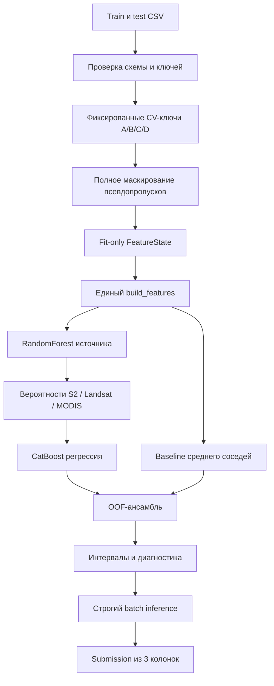

# Полное описание решения по восстановлению NDVI

Дата фиксации описания: **5 сентября 2026 года**.

Этот документ объясняет текущее ML-решение целиком: постановку задачи,
фактический контракт данных, защиту от утечек, схему валидации, признаки,
baseline, CatBoost, определение источника наблюдения, ансамбль, интервалы,
инференс, формат артефактов, тесты, результаты и известные ограничения.

Текущим принятым результатом является фиксированный запуск
`p0-catboost-gpu-v1`. Отдельный запуск подбора гиперпараметров ещё не включён в
итоговое решение: его можно принять только после проверки тем же протоколом.

## 1. Что решает система

Для каждого сельскохозяйственного полигона имеется временной ряд спутникового
индекса `primary_ndvi`. В части строк test этот индекс специально скрыт. Такие
строки отмечены `is_synthetic_gap = True`. Система должна восстановить
`primary_ndvi` только для этих строк.

NDVI — normalized difference vegetation index:

\[
NDVI = \frac{NIR - Red}{NIR + Red},
\]

где `NIR` — отражение в ближнем инфракрасном диапазоне, а `Red` — отражение в
красном диапазоне. Более высокое значение обычно соответствует более активной
растительности. Однако конкурсный `primary_ndvi` рассматривается как сырой
целевой ряд: решение не заменяет его сглаженным или гармонизированным рядом.

Для каждой скрытой строки требуется вернуть:

- тот же `anon_polygon_id`;
- ту же календарную `date`;
- конечное вещественное значение `primary_ndvi_pred`.

Итоговый submission содержит ровно **3 112** строк и только три колонки:

```text
anon_polygon_id,date,primary_ndvi_pred
```

## 2. Главная сложность задачи

У настоящей gap-строки скрыт не только target. На ней также отсутствуют
спутниковые индексы, погода и ранее вычисленные статистики. Следовательно,
модель не может использовать значение той же даты ни напрямую, ни через
производный признак.

Разрешённая информация состоит из:

- даты, из которой заново вычисляются год, месяц, день года и циклический
  календарь;
- идентификатора полигона и типа культуры;
- видимых наблюдений этого полигона на других датах;
- видимых наблюдений других полигонов;
- агрегатов, построенных только по разрешённым обучающим target.

Вторая сложность — перенос на новые объекты. Из 3 112 настоящих gaps только 464
относятся к полигонам, встречавшимся в train. Доля знакомых полигонов составляет
**14.91%**, а остальные **85.09%** относятся к новым полигонам. Поэтому
случайное разбиение отдельных строк дало бы слишком оптимистичную оценку.

Третья сложность — неоднородная природа target. `primary_ndvi` формируется по
приоритету:

1. Sentinel-2;
2. Landsat;
3. MODIS.

На скрытой строке источник заранее неизвестен. Разные сенсоры имеют разную
частоту наблюдений и систематические различия, поэтому вероятность источника
оценивается отдельной моделью.

## 3. Общая архитектура



Важное свойство архитектуры: проверка и production inference вызывают один и
тот же `build_features`. Отдельной упрощённой реализации признаков для test нет.

## 4. Фактические данные

### 4.1. Основные размеры

| Набор | Строки | Колонки | Полигоны | Период | Видимые target |
|---|---:|---:|---:|---|---:|
| Train | 99 955 | 21 | 39 | 2010-04-01 — 2024-10-30 | 30 520 |
| Test | 57 185 | 20 | 78 | 2010-04-01 — 2025-10-30 | 17 641 |

В train имеется 69 435 естественно пустых значений target. В test отсутствуют
39 544 target: 3 112 искусственных gaps и 36 432 естественных пропуска.
Естественно пустая строка не превращается в оцениваемую gap-строку.

Колонки объединяются в следующие смысловые группы:

| Группа | Поля |
|---|---|
| Ключ | `anon_polygon_id`, `date` |
| Sentinel-2 | `s2_ndvi`, `s2_evi`, `s2_ndwi` |
| Landsat | `landsat_ndvi`, `landsat_evi`, `landsat_ndwi` |
| MODIS | `modis_ndvi`, `modis_evi` |
| Погода ERA5 | `era5_temp_c`, `era5_precip_mm` |
| Календарь | `year`, `doy` |
| Цель | `primary_ndvi` |
| Производные статистики | `ndvi_climatology_mean`, `ndvi_climatology_std`, `n_reference_years` |
| Категория | `crop_type` |
| Только train | `ndvi_zscore`, `status` |
| Только test | `is_synthetic_gap` |

В данных представлены четыре типа культуры:

- озимая пшеница;
- зерновые;
- подсолнечник;
- пастбища/зерновые.

### 4.2. Распределение настоящих gaps

| Длина последовательности | Число gap-строк |
|---:|---:|
| 1 | 2 262 |
| 2 | 674 |
| 3 | 123 |
| 4 | 28 |
| 5 | 25 |

Большинство gaps имеют близкий видимый контекст. Слева расстояние не превышает
7 дней для 2 541 строк, справа — для 2 573 строк. При этом имеются края сезона и
длинные односторонние случаи, которые требуют отдельного fallback.

В 2025 году находятся 925 gaps. В train 2025 года нет, поэтому перенос на этот
год является одним из главных рисков.

### 4.3. Восстановленная иерархия источника

Для видимой строки источник определяется сравнением sensor NDVI с
`primary_ndvi` с абсолютным tolerance `1e-7`. Проверка идёт строго в порядке
S2 → Landsat → MODIS.

| Набор | S2 | Landsat | MODIS | Unknown |
|---|---:|---:|---:|---:|
| Train | 11 235 | 13 284 | 6 001 | 0 |
| Видимая часть test | 7 815 | 6 804 | 3 022 | 0 |

Таким образом, все 48 161 видимых target объясняются заданной иерархией. Для
настоящих gaps истинный источник неизвестен; распределение по видимым test
строкам используется только как приближённый ориентир.

### 4.4. Проверки контракта

Загрузчик данных:

- проверяет точный набор колонок до чтения pandas;
- запрещает повторяющиеся названия колонок;
- задаёт явные dtype и разбирает `date` как календарную дату;
- требует уникальность `anon_polygon_id + date`;
- запрещает пустые ключи и timezone-aware даты;
- считает target наблюдаемым только при конечном значении;
- проверяет, что на настоящих gaps скрыты динамические и производные поля;
- умеет сравнивать фактические размеры с контрольными числами;
- вычисляет SHA256 исходных файлов.

Исходные CSV никогда не изменяются на месте.

## 5. Как имитируются настоящие пропуски

Для честной оценки часть известных train-target временно превращается в
псевдопропуски. Функция `apply_mask` выставляет `NaN` в тех же полях, которые
отсутствуют на реальной gap-строке:

- `primary_ndvi`;
- S2: NDVI, EVI, NDWI;
- Landsat: NDVI, EVI, NDWI;
- MODIS: NDVI, EVI;
- температура и осадки ERA5;
- `year`, `doy`;
- климатологические mean/std;
- `ndvi_zscore`, `status`, `n_reference_years`, если они существуют.

После этого `year` и `doy` создаются заново только из `date`. Сохранённые в CSV
`status`, z-score и климатология gap-строки не используются.

Псевдопропуски выбираются по физическим ключам, а не по номерам строк. Поэтому
перемешивание DataFrame не меняет состав folds.

Matched-mask режим приближает структуру настоящего test:

- доля знакомых полигонов: 0.1490 против 0.1491;
- total variation distance по длинам gap-run: 0.0179;
- total variation distance по месяцам: 0.0223.

Распределения близки, но не идентичны: train не может полностью воспроизвести
календарный сдвиг 2025 года.

## 6. Защита от утечки target

Защита реализована на нескольких уровнях.

### 6.1. Маскирование до построения признаков

`build_features` сначала находит все запрошенные ключи и самостоятельно скрывает
на них target и динамические поля. Даже если вызывающий код забыл заранее
применить маску, значение той же строки не попадёт в признаки.

### 6.2. Fit-only state

Сезонные priors хранятся в `FeatureState`. State строится только по разрешённым
конечным target. В нём сохраняются ключи использованных строк. Если запрошенный
gap-ключ пересекается с `fit_keys`, feature builder завершает работу с ошибкой
`Target-prior leakage`.

### 6.3. Исключение групп

В grouped CV целый validation-полигон исключается из обучающих target и priors.
Его видимая история остаётся доступна как inference context, потому что такая же
история законно присутствует в test.

### 6.4. Leave-one-polygon-out на той же дате

Медиана и IQR других полигонов на той же дате вычисляются без текущего полигона.
Это не даёт значению объекта косвенно вернуться через cross-polygon агрегат.

### 6.5. Temporal censoring

В temporal CV state и контекст не содержат target из holdout-года. Модель решает
задачу переноса только из прошлого, а не интерполяцию между прошлым и будущим.

### 6.6. Sentinel tests

В тестах target validation-строк и все динамические поля заменяются значением
`1e9` до маскирования. Полученные признаки должны остаться прежними. Отдельный
тест меняет все target held-out полигона и проверяет, что fitted priors не
изменились.

Это проверяет известные каналы утечки, хотя не является математическим
доказательством отсутствия любого возможного дефекта.

## 7. Четыре режима валидации

Всего фиксированный протокол содержит **16 OOF-разбиений** и 13 317 оценок.

### 7.1. CV-A: matched-mask

- 5 повторов с seed 17, 29, 43, 71 и 101;
- по 1 200 validation-строк в повторе;
- всего 6 000 оценок;
- структура gaps приближена к настоящему test;
- это основной interpolation-like сценарий.

Один физический ключ может встречаться в разных повторах, но внутри одного fold
каждый ключ уникален.

### 7.2. CV-B: unseen-polygon

- 5 групповых folds;
- validation-полигоны целиком исключены из fit-target и fit-priors;
- всего 6 000 оценок;
- видимая история held-out полигона разрешена как контекст.

Этот режим особенно важен, потому что 85.09% настоящих gaps находятся на новых
полигонах.

### 7.3. CV-C: temporal

- holdout позднего 2024 года;
- только прошлые fit и context данные;
- всего 1 200 оценок;
- будущая сторона ряда полностью скрыта.

CV-C проверяет forecasting-перенос. Его нельзя интерпретировать как качество
обычной интерполяции между двумя соседями.

### 7.4. CV-D: hard

- 5 групповых folds;
- серии длиной 2–4;
- оставлен ровно один удалённый target-сосед;
- расстояние до него превышает 15 дней;
- validation-полигон исключён из fit;
- всего 117 оценок.

Это стресс-тест. Его оценка полезна для поиска отказов, но статистически менее
стабильна из-за небольшого размера.

### 7.5. Composite-критерий

Для инженерного выбора модели используется заранее зафиксированная формула:

\[
RMSE_{composite} =
0.50 RMSE_A + 0.25 RMSE_B + 0.15 RMSE_C + 0.10 RMSE_D.
\]

Composite не является официальной скрытой метрикой test. Он нужен для принятия
решений без подбора по leaderboard.

Официальный GapScore вычисляется из RMSE:

\[
GapScore = round\left(30 \cdot max\left(0, 1 - \frac{RMSE}{0.10}\right), 2\right).
\]

При RMSE ≥ 0.10 вклад этой части равен нулю.

## 8. Baseline-модели

Были измерены семь детерминированных вариантов на одинаковых OOF-ключах.

| Baseline | Composite RMSE | Решение |
|---|---:|---|
| Среднее ближайших соседей | **0.106699** | принят как основной baseline |
| Линейная интерполяция по времени | 0.107668 | отклонён |
| PCHIP | 0.110616 | отклонён |
| Akima | 0.113545 | отклонён |
| Ближайший справа | 0.120761 | отклонён |
| Ближайший слева | 0.121105 | отклонён |
| Сезонная климатология культуры | 0.173387 | оставлена только как fallback |

Основной baseline берёт ближайший конечный `primary_ndvi` слева и справа и
считает среднее. В отличие от линейной интерполяции, расстояния до соседей не
задают веса.

Если доступен только один сосед, прогноз равен среднему между этим соседом и
сезонным prior. Если соседей нет, применяется иерархия:

1. polygon × crop × 15-дневный сезонный bin;
2. polygon × crop;
3. crop × сезонный bin;
4. crop;
5. глобальный сезонный bin;
6. глобальная медиана;
7. явный default 0.5 для полностью пустого, не обученного state.

Fallback обязан возвращать конечное число. Автоматического clip нет.

## 9. Feature builder

Сохранённая таблица признаков имеет **301 колонку**. В неё входят ключи и точная
дата; `date` нужна для порядка и проверки, но исключается перед fit CatBoost.
Фактически CatBoost получает 300 остальных колонок, включая категориальные
`anon_polygon_id`, `crop_type` и `seasonal_prior_level`.

### 9.1. Календарь

- год, месяц и день года;
- ISO week;
- `sin(doy)` и `cos(doy)` для циклической сезонности.

### 9.2. Контекст target

- до четырёх предыдущих и четырёх следующих видимых target;
- расстояние в днях до каждого соседа;
- среднее двух соседей и линейная интерполяция;
- локальный уровень, IQR, slope и curvature;
- число и плотность наблюдений в окнах 7, 15 и 30 дней;
- положение и длина gap-run;
- edge flags и индикаторы отсутствующей стороны;
- `context_quality`, зависящий от числа доступных сторон и расстояния до
  ближайшего контекста.

### 9.3. Спутниковые и погодные ряды

Для `primary_ndvi`, S2/Landsat/MODIS NDVI, EVI, NDWI, температуры и осадков
формируются:

- raw, cleaned, invalid и missing признаки текущей строки;
- ближайшие значения слева и справа;
- расстояния до них;
- временная интерполяция;
- медиана, IQR, count и invalid count в 30-дневном окне.

Для погодных признаков дополнительно берётся медиана других полигонов на той же
дате. Если она недоступна, используется временная интерполяция внутри полигона.

Физические границы применяются только для очистки sensor/weather контекста и
создания flags:

- NDVI/NDWI: от −1 до 1;
- EVI: от −1 до 2;
- температура: от −100 до 70 °C;
- осадки: неотрицательные.

Конечный сырой `primary_ndvi` в разрешённом временном контексте не заменяется и
не обрезается. Это сохраняет конкурсную семантику, включая фактические выбросы.

### 9.4. Robust priors

Для разрешённых target сохраняются median, IQR и count по сочетаниям:

- polygon × crop × season;
- polygon × crop;
- crop × season;
- crop;
- global season;
- polygon × crop × year;
- crop × year.

Один сезонный bin равен 15 дням. Также сохраняются seen-polygon, частота культуры
и общий размер fit-target.

### 9.5. Cross-polygon и доступность сенсоров

- median/IQR/count target других полигонов на той же дате;
- дни с последнего и до следующего наблюдения каждого сенсора;
- число наблюдений сенсора в окнах 7/15/30 дней;
- число доступных sensor-строк на той же дате;
- локальные, same-date и fit counts источника.

### 9.6. Нелинейные интерполяции

PCHIP рассчитывается при наличии обеих сторон и как минимум трёх соседних точек.
Akima требует как минимум пять точек. При невозможности вычисления остаётся
`NaN`, который CatBoost умеет обрабатывать.

### 9.7. Что оказалось наиболее полезным

Средняя permutation importance по held-out данным показывает следующие ведущие
признаки:

| Признак | Средняя importance |
|---|---:|
| `landsat_ndvi_interpolated` | 0.012162 |
| `local_level` | 0.008959 |
| `primary_ndvi_interpolated` | 0.006160 |
| `linear_interpolation` | 0.004481 |
| `landsat_evi_interpolated` | 0.004228 |
| `same_date_target_median` | 0.003027 |
| `mean_neighbors` | 0.002865 |
| `primary_ndvi_context_median` | 0.002791 |
| `availability_modis_same_date_count` | 0.002295 |
| `p_modis` | 0.001584 |

Значения permutation importance нельзя складывать как независимые вклады:
многие признаки коррелируют и частично заменяют друг друга.

## 10. Классификатор источника

Истинный source известен только у видимой строки. Для gap используется
`RandomForestClassifier`:

- 200 деревьев;
- `min_samples_leaf = 8`;
- `class_weight = balanced_subsample`;
- фиксированный seed;
- CPU, до двух параллельных jobs в текущем запуске.

Классификатор получает строгий allowlist:

- календарь;
- polygon и crop;
- seen-polygon и crop frequency;
- календари доступности сенсоров;
- local/same-date/fit counts источников.

Он не получает target, sensor-значения текущей скрываемой строки или
растительные индексы этой строки.

Для обучающих примеров вероятности источника строятся через GroupKFold по
полигонам. Регрессор видит cross-fitted вероятности, а не прогноз модели,
обученной на source-label той же строки. После этого отдельный source classifier
обучается на всех разрешённых псевдопримерах для inference.

На выходе появляются `p_s2`, `p_landsat`, `p_modis`, `p_unknown` и максимум этих
вероятностей `source_confidence`.

Accuracy источника по CV:

| Режим | Landsat | MODIS | S2 |
|---|---:|---:|---:|
| A | 75.46% | 97.48% | 91.84% |
| B | 81.11% | 98.58% | 90.05% |
| C | 100.00% | 0.00% | 0.00% |
| D | 85.45% | 91.18% | 89.29% |

Резкий провал S2/MODIS в temporal-C показывает сдвиг календаря источников.
Вероятности поэтому не называются полностью откалиброванными.

## 11. CatBoost

Текущий зафиксированный результат использует `CatBoostRegressor` с нативными
категориями. Высококардинальный polygon ID не one-hot кодируется. Категории,
которых не было при fit, получают маркер `__unknown__`.

Фиксированные параметры:

| Параметр | Значение |
|---|---:|
| `iterations` | 700 |
| `depth` | 7 |
| `learning_rate` | 0.05 |
| `loss_function` | RMSE |
| `task_type` | GPU |
| `devices` | 0 |

Это фиксированная конфигурация: `hyperparameters.json` содержит пустой override,
поэтому используются перечисленные defaults. Seed меняется по сохранённому
outer fold; финальная модель использует seed 17.

Для каждого outer fold создаётся до 6 000 псевдопропусков. Они делятся на пять
блоков; в четырёх блоках полигоны блока дополнительно исключаются из target
priors. Это приближает большую долю unseen-полигонов в test.

Фиксированный цикл обучил:

- 16 CatBoost-моделей для OOF по режимам A/B/C/D;
- одну финальную CatBoost-модель на псевдопропусках полного train;
- cross-fitted и финальные source classifiers;
- затем выполнил permutation importance, fit ансамбля, interval-оценку и batch
  inference.

Полный цикл занял **43 минуты**. Зарегистрированный OOF/importance-этап занял
1 398 секунд. Подготовка признаков и RandomForest выполнялись на CPU, CatBoost —
на CUDA GPU.

## 12. Итоговые метрики


| Режим | N | Baseline RMSE | CatBoost RMSE | Ансамбль RMSE | Лучший |
|---|---:|---:|---:|---:|---|
| A: matched-mask | 6 000 | 0.088455 | **0.066256** | 0.068649 | CatBoost |
| B: unseen-polygon | 6 000 | 0.095591 | **0.071849** | 0.074441 | CatBoost |
| C: temporal | 1 200 | **0.178772** | 0.246606 | 0.220068 | Baseline |
| D: hard | 117 | 0.117576 | 0.114809 | **0.114671** | Ансамбль |

GapScore для тех же режимов:

| Режим | Baseline | CatBoost | Ансамбль |
|---|---:|---:|---:|
| A | 3.46 | **10.12** | 9.41 |
| B | 1.32 | **8.45** | 7.67 |
| C | 0.00 | 0.00 | 0.00 |
| D | 0.00 | 0.00 | 0.00 |

Composite:


| Вариант | Composite RMSE | Изменение к baseline |
|---|---:|---:|
| Baseline | 0.106699 | — |
| CatBoost | 0.099562 | −6.69% |
| Ансамбль | **0.097412** | **−8.70%** |

На наиболее похожих на test режимах A и B CatBoost заметно сильнее baseline. В
режиме C он значительно хуже. Поэтому результат нельзя считать надёжной
forecasting-моделью будущего сезона.

## 13. Почему выбран ансамбль

Веса выбираются только по OOF при условиях:

- каждый вес неотрицателен;
- сумма весов равна единице;
- минимизируется заранее заданный composite RMSE;
- test predictions и leaderboard не участвуют.

Итоговая формула:

\[
\hat y = 0.309550 \cdot \hat y_{baseline}
       + 0.690450 \cdot \hat y_{CatBoost}.
\]

Ансамбль немного хуже чистого CatBoost в A и B, потому что вес baseline выбран
глобально с учётом C и D. В результате composite лучше каждого отдельного
участника.

## 14. Проверенные gates и clip

Были проверены шесть правил, которые в отдельных ситуациях увеличивают вес
conservative baseline:

1. короткий двусторонний контекст;
2. длинный или односторонний gap;
3. unseen polygon;
4. низкая уверенность источника;
5. сильное расхождение моделей;
6. низкое качество контекста.

Gate можно принять только при одновременном выполнении условий:

- улучшилась медиана по повторам;
- unseen RMSE ухудшился не более чем на 0.003;
- улучшился composite;
- правило реально применилось хотя бы к одной строке.

Некоторые gates снижали composite, но ухудшали медиану повторов. Поэтому все
шесть отклонены, и в bundle записано `gate = null`.

Clip также не применяется: OOF-эксперимент, доказывающий его пользу, не
проводился. Это особенно существенно, поскольку в фактических данных имеются
значения raw target вне обычного физического диапазона: train от −2.1304 до
0.9621, видимый test от −0.6362 до 1.8429.

## 15. Неопределённость

Для каждой строки API возвращает `lower` и `upper`. Интервалы основаны на
абсолютных OOF-остатках принятого ансамбля.

Остатки делятся по двум типам контекста:

- `short_two_sided`: обе стороны доступны не дальше 15 дней;
- `hard_context`: остальные случаи.

Вторая ось binning — наиболее вероятный источник S2/Landsat/MODIS либо
`uncertain` при максимальной вероятности ниже 0.65. Bin используется только при
размере не меньше 60; иначе берётся глобальный квантиль.

Глобальные радиусы:

| Номинальный уровень | Радиус |
|---:|---:|
| 80% | 0.080910 |
| 95% | 0.189409 |

Cross-fold проверка удаляет из calibration pool весь оцениваемый fold и все
повторения тех же физических ключей.

| Подгруппа | Coverage 80% | Средняя ширина 80% | Coverage 95% | Средняя ширина 95% |
|---|---:|---:|---:|---:|
| Overall | 79.09% | 0.2063 | 93.94% | 0.3898 |
| Unseen | 80.06% | 0.1986 | 95.07% | 0.3814 |
| Hard | 85.47% | 0.2905 | 94.87% | 0.5321 |

Средние значения близки к номинальным, но отдельные folds их не выдерживают.
Поэтому статус — `empirical_oof_not_certified`. Это эмпирическая оценка риска,
а не формальная гарантия coverage.

## 16. Два выходных NDVI-ряда

Система различает два продукта.

### 16.1. `primary_ndvi_reconstructed`

Это восстановление сырого конкурсного ряда. Для gaps оно равно
`primary_ndvi_pred`; видимые исходные значения сохраняются без изменения. Именно
эта семантика используется в submission.

### 16.2. `ndvi_harmonized`

Это отдельный ряд для визуализации и анализа аномалий. Sensor-wise robust affine
преобразования приводят Landsat и MODIS к reference S2:

| Источник | Число пар | Slope | Offset |
|---|---:|---:|---:|
| S2 | 11 235 | 1.000000 | 0.000000 |
| Landsat | 2 307 | 1.069254 | −0.065404 |
| MODIS | 657 | 1.153573 | −0.174832 |

Для восстановленной строки преобразования смешиваются по вероятностям источника.
Гармонизированный ряд не заменяет конкурсный target и не попадает в submission.

## 17. Anomaly baseline

Отдельный модуль строит описательные отрицательные события по
`ndvi_harmonized`:

1. для каждой точки выбираются только предыдущие годы того же polygon/crop;
2. reference окно составляет ±15 дней года;
3. требуется не меньше трёх reference years;
4. считаются median, MAD, residual и robust z-score;
5. кандидатом считается только отрицательное отклонение с `robust_z <= -2`;
6. событие требует минимум две последовательные точки;
7. максимальный разрыв внутри события — 16 дней;
8. severity равен `magnitude × duration × confidence`.

Reason codes могут показать совпадение с низкими осадками, высокой температурой,
низким NDWI или согласованностью нескольких сенсоров. Они не утверждают
причинно-следственную связь.

## 18. Production inference

### 18.1. Публичный Python-контракт

```python
@dataclass(frozen=True)
class ReconstructionRequest:
    frame: pd.DataFrame
    gap_mask: pd.Series
    context_mode: Literal["competition", "web"]

@dataclass(frozen=True)
class ReconstructionResult:
    predictions: pd.DataFrame
    diagnostics: pd.DataFrame
    model_version: str
```

`competition` требует точного совпадения переданной маски с
`is_synthetic_gap`. В `web` разрешена явная выровненная boolean mask. Входной
DataFrame копируется и не изменяется.

### 18.2. Шаги одного predict

1. Проверяется запрос, индекс, ключи, даты и mask.
2. Из mask извлекаются gap-ключи с сохранением порядка.
3. Единый `build_features` строит признаки.
4. Baseline заранее вычисляется как гарантированный fallback.
5. Source classifier выдаёт вероятности источника.
6. CatBoost выдаёт регрессионный прогноз.
7. Применяются сохранённые OOF-веса ансамбля.
8. Нечисловой ответ модели заменяется baseline.
9. Добавляются интервалы, harmonized value и диагностика.
10. Проверяется конечность обязательных числовых результатов.

### 18.3. Predictions

Расширенный API возвращает:

- ключи;
- `primary_ndvi_pred`;
- `lower`, `upper`;
- `method`;
- `primary_ndvi_reconstructed`;
- `ndvi_harmonized`.

### 18.4. Diagnostics

Для каждой строки возвращаются:

- четыре вероятности источника;
- расстояния до левого и правого target-контекста;
- расхождение baseline и CatBoost;
- fallback reason;
- context quality и source confidence;
- quality flags;
- статус и уровень интервала;
- статус гармонизации.

Quality flags отмечают unseen polygon, односторонний контекст, неопределённый
источник, незаверенную interval coverage, неполную harmonization и замену
нечислового model output.

## 19. Batch inference и строгий submission

Batch-команда загружает bundle один раз, вызывает тот же Python API и сохраняет
диагностику отдельно. Перед атомарной заменой итогового файла проверяются:

- точные названия и порядок трёх колонок;
- точный упорядоченный набор 3 112 gap-ключей;
- отсутствие дублей и пустых ключей;
- формат даты `YYYY-MM-DD`;
- numeric dtype prediction;
- отсутствие boolean, `NaN` и infinity;
- UTF-8 без BOM;
- ровно три значения в каждой CSV-строке.

При ошибке команда возвращает ненулевой exit code. Submission не содержит
интервалы, вероятности источника или служебную диагностику.

## 20. Model bundle и воспроизводимость

Текущая версия bundle: `p0-catboost-gpu-v1`, schema `1.0`, feature version
`ndvi-context-v1`.

Bundle состоит из:

- `feature_state.json` — fit-only priors и метаданные признаков;
- `config.json` — веса, feature schema, uncertainty, harmonization и решения;
- `estimators.joblib` — CatBoost и source classifier;
- `manifest.json` — версия, seeds, fingerprints, CV summary, package versions и
  SHA256 каждого файла.

Загрузчик сначала проверяет schema, безопасные относительные пути и все SHA256.
Только после этого разрешается десериализация estimator-файла. Trained bundle
требует явного `trusted=True`, поскольку SHA256 проверяет целостность, но не
доказывает происхождение joblib.

Зафиксированные fingerprints:

| Объект | SHA256 |
|---|---|
| Train CSV | `a75e530d0fb51581ad6800f84b3875233778801491f02236917862faf9b424ec` |
| Test CSV | `3c5c0e27eef8266bcf6dce09c9b556c073cee3902c065a94e4ea7a59edb00993` |
| Folds CSV | `ba1ae945c43820d05bbcbdbf7faf2982c07cbd2ed59aa6fb0a53c3f25f3484a8` |

Seeds: 17, 29, 43, 71, 101. Финальный submission фиксированного запуска имеет
SHA256 `12ed0c3b8c4da6c8d512b89cc996f1bdec707cfb83cf2496b9449c3bc36a4637`.

В manifest фиксированного cloud-запуска поле `git_commit` равно `unavailable`,
поскольку переносимый training-пакет не содержал `.git`. Воспроизводимость
сохраняется через fingerprints данных/folds, версии признаков, параметры, seeds,
package versions и hashes model files, но отсутствие commit SHA остаётся
ограничением этого первого запуска.

## 21. Автоматические тесты

Проходят **20 unittest-тестов**. Они покрывают:

- контрольные размеры текущих CSV;
- schema, типы, дубли ключей и nonfinite значения;
- точное маскирование без изменения исходного DataFrame;
- иерархию S2 → Landsat → MODIS;
- sentinel-проверку всех динамических полей;
- исключение held-out групп из priors;
- исключение текущего полигона из same-date агрегатов;
- детерминированные folds;
- past-only temporal и one-sided hard политики;
- toy-ряды: interior, edge, gap length 4 и отсутствие соседей;
- сохранение raw target без автоматического clip;
- корректность неотрицательного ансамбля;
- feature/inference path обученного bundle через test doubles;
- schema и SHA256 model bundle;
- строгий submission;
- равенство Python API и CLI;
- пустой запрос и неправильную mask;
- отрицательные persistent anomalies только по прошлым годам;
- отделение harmonized ряда от target;
- запрет неявного запуска обучения;
- отсутствие утечки в pseudo-training;
- GPU factory contract без запуска fit.

Кроме unit-тестов, фиксированный GPU-цикл загрузил сохранённый bundle, выполнил
полный batch inference и прошёл post-validation submission.

## 22. Что реализовано в коде, но не входит в принятый результат

Фабрики поддерживают HGB, ExtraTrees и LightGBM, однако текущие зафиксированные
OOF-метрики относятся только к CatBoost. Нельзя приписывать этим моделям
результаты без отдельного обучения на тех же folds.

Также не включены в принятое решение:

- условные gates — все шесть отклонены;
- target clip — нет OOF-доказательства пользы;
- MAPIE/EnbPI — не запускались;
- Whittaker/HANTS — не измерялись;
- географические признаки — геометрия и region отсутствуют в CSV;
- продвинутый детектор аномалий — реализован только устойчивый baseline;
- параметры tuning-запуска — пока не прошли итоговое сравнение.

## 23. Ограничения результата

1. **Temporal shift.** CatBoost ухудшает CV-C: 0.246606 против 0.178772 у
   baseline. Перенос на 2025 год остаётся основным риском.
2. **OOF selection bias.** Эти же OOF использовались для выбора baseline, весов
   и проверки gates. Поэтому composite не является полностью независимой
   оценкой обобщения.
3. **Нет скрытой test-метрики.** Представленные числа относятся к OOF, а не к
   leaderboard или известным ответам test.
4. **Малый CV-D.** Hard-режим содержит 117 точек и чувствителен к отдельным
   ошибкам.
5. **Source shift.** Классификатор источника показывает сильный сдвиг в CV-C.
6. **Intervals not certified.** Средний coverage близок к nominal, но отдельные
   folds проваливают порог.
7. **Raw anomalies.** В target есть значения вне обычного диапазона NDVI; они
   намеренно не обрезаны без OOF-эксперимента.
8. **Нет геометрии.** Нельзя построить честные региональные календари и
   пространственные признаки.
9. **Первый manifest без commit SHA.** Зафиксированы остальные hashes и версии,
   но точная Git-ревизия внутри training environment не определилась.

## 24. Текущий статус и следующий критерий решения

Фиксированное решение завершено: bundle, OOF, интервалы, source diagnostics,
feature importance, submission и batch-проверка получены. Его принятый
composite RMSE равен **0.097412**.

Отдельный tuning-запуск проверяет 30 конфигураций CatBoost с TPE sampler и
MedianPruner на тех же сохранённых folds. Первые пять trials выполняются до
конца для формирования статистики pruning. После tuning заново выполняются
полный OOF, выбор ансамбля, importance, финальный fit и batch inference.

Tuned-вариант следует принять только после проверки:

1. совпали fingerprints исходных данных и folds;
2. пройдены те же тесты и submission validation;
3. composite RMSE лучше 0.097412;
4. улучшение не получено ценой неприемлемого ухудшения unseen и temporal;
5. bundle, параметры и отрицательные trials сохранены;
6. отчёт и графики обновлены только фактическими итоговыми числами.

До такой проверки фиксированный `p0-catboost-gpu-v1` остаётся текущим решением.

## 25. Карта основных файлов

| Путь | Назначение |
|---|---|
| `src/veg_recovery/data/io.py` | чтение, schema, контрольные числа, fingerprints |
| `src/veg_recovery/validation/masking.py` | точное маскирование псевдопропусков |
| `src/veg_recovery/validation/folds.py` | режимы A/B/C/D и split policies |
| `src/veg_recovery/validation/metrics.py` | RMSE, GapScore, composite и subgroup metrics |
| `src/veg_recovery/features/builder.py` | fit-only state и единый feature builder |
| `src/veg_recovery/models/baselines.py` | интерполяционные baselines и fallback |
| `src/veg_recovery/models/estimators.py` | source classifier и regressors |
| `src/veg_recovery/models/calibration.py` | OOF blend, gates и uncertainty |
| `src/veg_recovery/models/training.py` | полный training/evaluation pipeline |
| `src/veg_recovery/models/bundle.py` | сохранение и безопасная загрузка bundle |
| `src/veg_recovery/inference.py` | единый production predict |
| `src/veg_recovery/cli/batch.py` | batch inference и строгий submission |
| `src/veg_recovery/anomalies/baseline.py` | harmonization и anomaly baseline |
| `tests/ml/test_ml.py` | 20 автоматических тестов |
| `configs/ml/folds_v1.csv` | фиксированные validation-ключи |
| `configs/ml/training_p0.json` | версия протокола и текущий результат |
| `reports/ml_ablation.md` | журнал гипотез, экспериментов и решений |
| `reports/model_metrics.csv` | компактная таблица метрик для графиков |

Тяжёлые обученные модели, рабочие кэши, переносимые архивы и исполняемые
ноутбуки не хранятся в Git. В репозитории остаются код, конфигурации, folds,
проверяемые baseline-артефакты, агрегированные результаты и документация.
