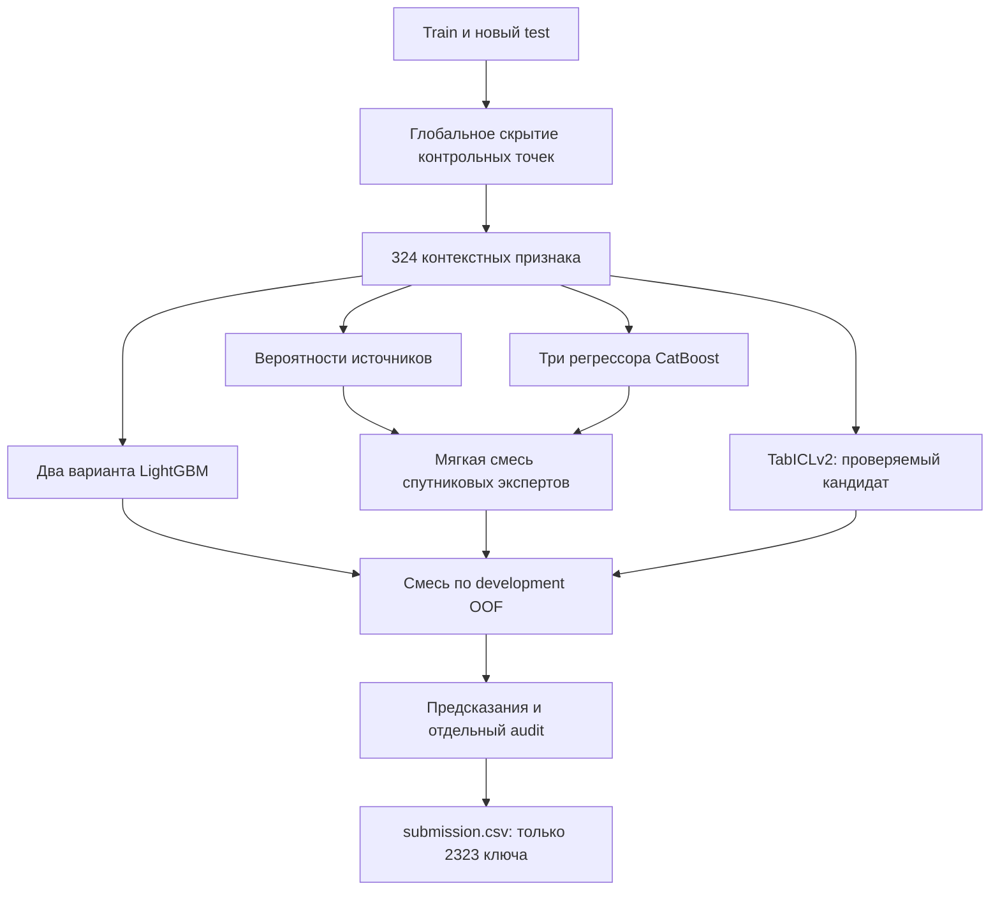

# Решение NDVI: исследование данных и моделей

Дата проверки источников: 5 сентября 2026. Область работы — ML/DL, пакетный inference и аналитика. Сервер, интерфейс и сбор данных для пользовательских полигонов сюда не входят.

## Решение за две минуты

Мы восстанавливаем скрытые измерения **внутри** уже известного временного ряда. Измерения после пропуска доступны и полезны. Это отличается от прогноза следующего неизвестного сезона: проверка с удалением целого последнего года измеряет другую задачу и не должна определять основную смесь моделей.

Главный проверенный подход — контекстные признаки, два варианта LightGBM и три спутниковых эксперта CatBoost с мягким выбором источника. Значение `primary_ndvi` во всех видимых строках совпадает с первым доступным значением в порядке Sentinel-2 → Landsat → MODIS. Поэтому важно восстановить и ожидаемый источник, и его значение. Смешивать спутники как одну гладкую кривую недостаточно.

Предобученные модели проверяются как дополнительные кандидаты. Реальный локальный запуск TabICLv2 на 4 000 примерах контекста не улучшил выбранную смесь. Для Kaggle предусмотрен эксперимент на 12 000 примерах и четырёх членах внутреннего ансамбля. Этот увеличенный запуск ещё не измерен на GPU: сильный внешний benchmark не доказывает выигрыш на наших пропусках.

Результаты и окончательный выбранный файл приведены в `RESULTS.md`. Таблица здесь не заменяет фактические `metrics.json`, построчные OOF и контрольный CSV.

## 1. Что именно изменилось в данных

| Параметр | Train | Новый test |
|---|---:|---:|
| Строки | 99 955 | 49 190 |
| Полигоны | 39 | 20 |
| Видимые primary_ndvi | 30 520 | 13 164 |
| Контрольные пропуски | Не размечены; создаём сами | 2 323 |
| Период | 2010-04-01 — 2024-10-30 | 2010-04-01 — 2024-10-30 |
| Дубликаты polygon/date | 0 | 0 |
| Видимые цели вне [-1,1] | 1 | 4 |

Пересечение полигонов train/test пустое. Новый test проверяет перенос на поля, которые глобальная модель не видела при обучении, но у которых есть собственная наблюдаемая история. В нём **нет 2025 года**. Из 2 323 пропусков 1 232 относятся к 2010–2019 и 1 091 к 2020–2024.

Все динамические поля контрольных точек скрыты, включая спутниковые индексы, погоду, `year`, `doy`, `n_reference_years`. Год и день года пересчитываются из даты. Прежний `test_data.csv`, его цели, прогнозы и статистики не используются нигде. CSV из архива содержит именно обновлённый test; проверяется SHA256.

Нельзя брать `status`, `ndvi_zscore`, `ndvi_climatology_mean/std` организаторов в признаки: они зависят от целевого ряда и отсутствуют в новой тестовой схеме. Собственную климатологию считаем заново из разрешённого контекста.

Видимые цели по источникам: train — S2 11 235, Landsat 13 284, MODIS 6 001; новый test — S2 4 948, Landsat 5 556, MODIS 2 660. Доля скрытых от исходно измеренных значений нового test составляет около 15%.

### Почему не обрезаем всё до физического диапазона

В train есть значение −2,13038, в видимом test — значения до 1,68303. Мы не знаем, исправляет ли организатор такие измерения в скрытой оценке. Поэтому RMSE считается по исходным меткам, и финальные предсказания не обрезаются без отдельного доказанного выигрыша. Для климатологических норм и парных калибровок исключаем физически некорректные измерения; для моделей есть отдельный ограниченный вариант интерполяции. Для агрономической интерпретации такие точки помечаются как проблемы качества.

## 2. Архитектура

Схема допускает нулевые веса. Кандидат, который не помогает на development, не включается ради названия технологии. `cat` и `cat_residual` проверены как самостоятельные альтернативы; итоговая таблица показывает, какие компоненты выбраны.

### 2.1. Как понимается неизвестный источник

Скрытого `s2_ndvi` у запроса нет, поэтому запрещено определять источник по текущему наличию индекса. Классификатор видит только календарь и контекст: интервалы до соседних наблюдений каждого спутника, их число в сезоне, наблюдения других AOI в ту же дату, периоды повторных съёмок и численные характеристики соседних рядов.

Он выдаёт три вероятности. Каждый регрессор обучается только на целях своего реального источника. Его цель — поправка к интерполяции этого спутника. При восстановлении:

\[
\hat y_{expert}=p_{S2}\hat y_{S2}+p_{Landsat}\hat y_{Landsat}+p_{MODIS}\hat y_{MODIS}.
\]

В отличие от жёсткого выбора спутника, мягкая смесь не полностью доверяет одному сомнительному решению классификатора. Вероятности источника не подмешиваются в тренировочные строки обычного регрессора через in-sample прогноз классификатора; это исключает отдельный канал утечки.

### 2.2. Какие признаки действительно доступны

| Блок | Содержание | Зачем |
|---|---|---|
| Календарь | Год, DOY, crop; sin/cos абсолютной даты с периодами 5, 8, 10, 16, 32, 365,25 и 182,625 дня | Сезонность и фазы расписаний съёмки |
| Основной NDVI | До четырёх строго предыдущих и следующих измерений в том же году, расстояния в днях | Форма локальной кривой и длина пропуска |
| Три спутниковых NDVI | Такие же признаки по отдельности | Разный масштаб, частота и распределение измерений |
| Интерполяции | Линейная, полусумма соседей, ближайшее значение, ограниченный дополнительный вариант | Несколько объяснимых оценок локального состояния |
| Окна | Средние и разброс доступных соседей в пределах 21/45 дней; наклон и число наблюдений | Устойчивость к отдельным шумным измерениям |
| EVI, NDWI, погода | Два соседа с каждой стороны, интервалы и простые локальные характеристики | Дополнительная информация о динамике растительности и условиях |
| Межгодовая норма | Среднее, разброс и число лет по тому же полю и спутнику; текущий год исключён | Опора при редком контексте |
| Синхронные наблюдения | Среднее, медиана, std, количество по дате и по date/crop | Свидетельство съёмки и общей ситуации |
| Ряды других полей | До 3/10 коррелирующих рядов, парная калибровка, доступность и сила связи | Дополнительная оценка при наличии одновременных измерений |
| Согласованность | Разницы между спутниковыми интерполяциями, нормой и основным рядом; односторонность | Понимание ненадёжности контекста |

Важно: значения `mean21/45` вычислены по выбранным ближайшим соседям внутри радиуса, а не по всем ежедневным строкам. В данном ряду наблюдения нерегулярны. Нельзя описывать эти признаки как полный ежедневный интеграл.

Числовой суффикс AOI и обучаемый ID полигона отсутствуют в матрице модели. AOI используется только как ключ для поиска собственной истории. Мы не утверждаем, что коррелирующие поля географически близки, и не пытаемся восстановить координаты из анонимизации.

Для нормы сначала отдельно усредняются измерения каждого референсного года в окрестности DOY: Gaussian bandwidth 12 дней, обрезка радиуса 30 дней. Затем усредняются годы. Это не позволяет одному плотному S2-сезону доминировать над всеми остальными годами.

### 2.3. Работа с другими полями

У пары полей требуется минимум 12 совместных наблюдений одного спутника. Связи с корреляцией меньше 0,2 не используются. Линейный перевод одного ряда в масштаб другого сжимается к тождественному преобразованию, а наклон ограничен. Вес связан с четвёртой степенью положительной корреляции и числом совместных измерений. Все парные оценки пересчитываются после удаления контрольной маски.

Этот блок не является безусловным улучшением. В коде есть вариант `lgb_nodonor`; точные сравнения находятся в `experiments.csv`. Даже небольшое различие ошибок двух вариантов иногда помогает смеси, но само по себе не доказывает переносимость на новый регион.

## 3. Как организовано обучение

### 3.1. Честные тренировочные примеры

Train разбивается на семь групп маскирования внутри polygon/year. Для очередной группы удаляются **все** динамические значения всех её строк. Признаки строятся на оставшемся контексте, а исходные `primary_ndvi` становятся целями. Таким образом, на одну эпоху генерации приходится примерно 30 520 задач восстановления, а не несколько тысяч произвольно выбранных строк.

Семь групп дают около 14,3% скрытия, что близко к примерно 15% test. Дополнительные круги меняют окружение одних и тех же целей и учат переносить отсутствие соседей. Три круга — это 91 560 тренировочных примеров при финальном refit, но **не 91 560 независимых измерений**. Это важно честно сказать на защите.

Внешняя валидация использует около 15% известных измерений каждого polygon/year. Естественные пропуски не становятся целями и не считаются нулями.

### 3.2. Разделение проверки

Есть четыре фиксированные группы полигонов: 10, 10, 10 и 9. В конкретном fold никакая цель от его отложенных полигонов не попадает в supervised fit. Видимая часть их истории остаётся доступна: именно такой контекст есть у новых тестовых полей.

Folds 0–2 — development, 3 492 контрольные точки. На них выбираются кандидаты и веса. Fold 3 — audit, 1 079 точек; его значения не передаются подбору весов или `.fit`. Весь набор OOF содержит 4 571 предсказание на точках 39 полигонов. Случайные seed, полигоны и скрытые row_id сохранены в manifests.

Валидационный контекст берётся только из официального train. При окончательном восстановлении доступен train плюс видимые данные нового test. Глобальное supervised обучение использует только официальный train. Это консервативная политика: test нужен как контекст восстановления, его видимые цели не добавляются в глобальную тренировочную таблицу.

Здесь подтверждается перенос между анонимными полигонами этого набора. Координат и меток региона нет, поэтому назвать это доказанным переносом между независимыми географическими регионами нельзя. Предыдущая проверка с удалением целого 2024 года остаётся стресс-тестом прогноза, но не определяет основную метрику восстановления.

### 3.3. Модели и метрика

CatBoost: RMSE, learning_rate 0,04, глубина 7 для прямого варианта и 6 для остаточных/спутниковых экспертов; L2 8–12; border_count 128. Источник определяется классификатором до 700 итераций. Спутниковые регрессоры используют до 1 200 итераций. Полные параметры находятся в `ndvi/models.py`.

LightGBM: learning_rate 0,025, 31 лист, минимум 45 примеров в листе, L2 8, подвыборка строк и столбцов 0,85. Он работает на CPU даже в GPU-сессии: для этой таблицы не требуется сборка OpenCL.

Количество итераций основного запуска фиксировано заранее. Outer audit не используется для early stopping. Для следующего HPO нужен inner split и отдельный run directory; нельзя подбирать число итераций по audit и продолжать называть его независимой проверкой.

Для смеси минимизируется MSE development OOF при неотрицательных весах с суммой 1 и небольшом регуляризаторе. Веса меньше 1% удаляются. Затем веса применяются к audit и test без перенастройки. Не используем специальный «режим C/D», который возможен лишь потому, что разработчику известна метка проверки.

\[
RMSE=\sqrt{\frac{1}{N}\sum_i(y_i-\hat y_i)^2},\quad
GapScore=\operatorname{round}\left(30\max\left(0,1-\frac{RMSE}{0.10}\right),2\right).
\]

Порог 0,10 означает: улучшение RMSE на 0,001 даёт около 0,3 балла в метрической части, если RMSE ниже порога. Это преобразование **локальной** ошибки; результат на скрытом сервере организатора остаётся неизвестным.

## 4. Что найдено среди современных моделей

| Кандидат | Проверенный факт | Решение для этих данных |
|---|---|---|
| TabICLv2 | Публичный регрессионный checkpoint от 12.02.2026; контекстное обучение на таблицах | Реализован и проверен локально; увеличенный GPU-вариант включён в Kaggle-план |
| TabPFN-3 | Публикация 13.05.2026; новая версия уже доступна | Сильный дополнительный кандидат, но не включён автоматически из-за специальной лицензии и условий доступа |
| TimesFM-3 | Google опубликовал многомерную forecasting-модель 31.08.2026 | Очень свежая, но не прямой заменитель двустороннего восстановления |
| Chronos-2 | Поддерживает прогноз нескольких рядов и ковариат | Возможен будущий forward/reverse-эксперт, приоритет ниже прямых imputation-методов |
| Prithvi-EO-2.0 | Предобучение на шестиканальных HLS-изображениях; есть модели до 600M | CSV индексов не заменяет входные растровые каналы, необходимы координаты и снимки |
| SAITS | Специализированная attention-модель заполнения пропусков | Уместна для задачи; требует отдельной адаптации масок и обучения, не объявлена готовой без запуска |
| Mitra | Предобученный табличный регрессор, Apache-2.0 | Резервный кандидат при дополнительном времени; не устанавливаем весь AutoGluon ради непроверенного улучшения |

Источники: [TabICLv2, статья](https://arxiv.org/abs/2602.11139), [официальный код TabICL](https://github.com/soda-inria/tabicl), [TabPFN-3, статья](https://arxiv.org/abs/2605.13986), [Google TimesFM-3](https://research.google/blog/timesfm-3-a-zero-shot-foundation-model-for-multivariate-forecasting/), [Chronos-2](https://github.com/amazon-science/chronos-forecasting), [Prithvi model card](https://huggingface.co/ibm-nasa-geospatial/Prithvi-EO-2.0-600M), [SAITS](https://github.com/WenjieDu/SAITS), [Mitra model card](https://huggingface.co/autogluon/mitra-regressor).

### Почему TabICL — DL, хотя на входе таблица

Это предобученная нейросеть, а не ещё одно дерево. Она получает примеры с известными ответами как контекст и делает регрессионный прогноз. В текущем эксперименте веса нейросети не дообучались. `.fit` подготавливает контекст; основная работа происходит при inference. В нашей интеграции отбираются 96 признаков **на тренировочной части каждого fold**, поэтому важности с другого fold не переносят его ответы в проверку.

Контрольная проверка загрузки, прогнозов и сериализации на CPU прошла. Полный локальный кандидат использовал 4 000 строк и два члена внутреннего ансамбля. Kaggle-кандидат использует 12 000 строк, четыре члена и batch_size=1; offloading автоматический. Не предполагаем, что две T4 автоматически дают 32 GB единой памяти: запуск использует одну CUDA-карту. Если памяти или интернета нет, ошибка записывается, готовый tree-кандидат сохраняется.

Checkpoint и его SHA256 записываются в manifest. Код TabICL и карточка весов указывают BSD-3-Clause. [Карточка весов](https://huggingface.co/jingang/TabICL), [лицензия кода](https://github.com/soda-inria/tabicl/blob/main/LICENSE).

Новейшая идея retrieval-контекста изучена по [Localized TabICLv2, 17.08.2026](https://arxiv.org/abs/2608.16429): автор оценивает классификацию и retrieval в представлениях самой модели. Это не доказательство выигрыша на NDVI-регрессии. Наш sampling контекста — пропорциональная стратификация, а не реализация этой статьи.

### Условие для TabPFN-3

В лицензии отдельно описаны допустимые Data Science Competitions и ограничения non-commercial/non-production; также есть ограничения на сервисное использование. Нужно проверить применимость именно к команде и формату конкурса, условия доступа к весам и будущему продукту. В готовом пакете нет весов и прогнозов TabPFN-3; автоматическое принятие условий не выполнялось. [Текст лицензии](https://huggingface.co/Prior-Labs/tabpfn_3/blob/main/LICENSE), [официальная таблица версий](https://docs.priorlabs.ai/models).

Не следует утверждать, что TabPFN-2.5 остаётся последней версией, либо что любая открытая карточка весов разрешает все виды использования.

## 5. Внешние данные: что можно извлечь из USGS

EarthExplorer действительно подходит для поиска Landsat. Его поиск требует области интереса. В предоставленных CSV и отчётах нет геометрий или таблицы соответствия координат анонимным AOI. Значит, напрямую получить дополнительные наблюдения **этих же** 20 тестовых полей сейчас невозможно. [EarthExplorer](https://earthexplorer.usgs.gov/).

Если организаторы предоставят `anon_polygon_id → GeoJSON` и сведения о первоначальной агрегации, порядок такой:

1. Сначала восстановить ровно их способ расчёта: коллекция, каналы, scale/offset, QA, границы поля, агрегирование пикселей, дата/композит и приоритет источников.
2. Проверить совпадение с видимыми NDVI на нескольких десятках polygon/date. Другой физически корректный способ расчёта может не совпадать с целевыми значениями соревнования.
3. Только затем добавлять новые признаки из изображений. Если из открытых данных восстанавливается именно исходная контрольная запись, отдельно проверить, разрешён ли такой способ правилами; общее разрешение внешних данных не трактовать как разрешение добывать закрытые ответы.
4. Сначала проверить прирост на сохранённых псевдомасках; не тратить весь бюджет на массовую загрузку до этой проверки.

| Источник | Применимость | Существенная деталь |
|---|---|---|
| Landsat Collection 2 Level-2 | Длинный период, включая 2010-е через Landsat 5/7 и позднее 8/9 | Surface reflectance: DN × 0,0000275 − 0,2; учесть QA_PIXEL и QA_RADSAT |
| Sentinel-2 SR Harmonized | Более детальная пространственная структура поздних лет | Harmonized нужен для согласованности baseline; GEE-коллекция начинается 28.03.2017 |
| MOD13Q1 v061 | Длинная история NDVI/EVI, но 250 м и 16-дневные композиты | Различать дату композита и фактический DOY; использовать качество пикселя |
| NASA HLS | Согласованные Landsat/Sentinel данные для растровых экспертов | Landsat-часть с 2013, Sentinel-часть с 2015; не закрывает 2010–2012 |

Официальные источники: [USGS Landsat Level-2](https://www.usgs.gov/landsat-missions/landsat-collection-2-level-2-science-products), [Sentinel-2 SR Harmonized](https://developers.google.com/earth-engine/datasets/catalog/COPERNICUS_S2_SR_HARMONIZED), [MOD13Q1](https://developers.google.com/earth-engine/datasets/catalog/MODIS_061_MOD13Q1), [NASA HLS](https://hls.gsfc.nasa.gov/).

Landsat позволяет использование своих продуктов без ограничений, с рекомендованным цитированием. Для остальных коллекций нужно сохранять их собственные условия. В текущем обученном решении внешние снимки **не использовались**; перечисленные коллекции — исследованные возможности, а не заявленное обогащение данных.

## 6. Аномалии, неопределённость и интерпретация

`ndvi/diagnostics.py` создаёт ML-слой аналитики без сервера. Норма считается отдельно для источника и поля, без текущего года; минимум три референсных года, std снизу ограничен 0,03. Отрицательные z-score ниже −1/−2 дают кандидатов отклонения. Нужны минимум два реальных наблюдения, длительность от восьми дней, разрыв между сигналами не более 16 дней.

Это **эвристический детектор кандидатов**, а не модель с подтверждёнными precision/recall: разметки причин аномалий нет. Восстановленные точки не подтверждают аномалию сами по себе и не используются повторно для построения нормы. Падение NDVI может объясняться уборкой, сменой культуры, облачностью, снегом или стрессом. Код не выдаёт засуху как установленную причину.

Интервалы вокруг восстановлений используют 90-й процентиль абсолютной ошибки development OOF. На audit отдельно измеряется покрытие. Из-за временной зависимости и сдвига между полями это эмпирические интервалы, без заявления о гарантированном conformal coverage. Дополнительно считается bootstrap-интервал RMSE с пересэмплированием целых полигонов, а не отдельных коррелирующих дат.

Это полезные материалы для критериев интерпретируемости, аномалий, дополнительных идей и исследования. Критерии UI, карты, автосбора и управления полигонами этим ML-пакетом не закрываются.

## 7. Что говорить на защите

«Мы восстанавливаем значения в нерегулярных спутниковых рядах. Главное отличие нашего подхода — модель понимает, что целевой NDVI составлен из трёх разных источников. Она учитывает измерения до и после пропуска, историю сезонов и признаки доступности съёмок. Проверку проводим на целиком отложенных полигонах, скрывая все динамические каналы контрольных дат. Веса моделей выбираются на development, отдельный audit показывает перенос. Предобученную нейросеть мы тоже проверили; её наличие в финальном решении определяется измеренным улучшением. Ошибки, маски, веса и submission доступны для воспроизведения».

Точные числа возьмите из `RESULTS.md`. Не заявляйте официальный балл до проверки сервером, подтверждённую агрономическую причину без разметки, снимки USGS без фактической загрузки или «лучшую в мире модель» без сопоставимой оценки.

## 8. На что потратить оставшееся время

1. Иметь готовый проверенный CSV и резервную копию.
2. Запустить воспроизводимый Kaggle-пайплайн с увеличенным числом масок.
3. Проверить увеличенный TabICLv2 на тех же folds и добавить его только по development-результатам.
4. Если остаётся время, проверять одну гипотезу за раз: контекст 8k/16k, число масок, остаточный TCN/SAITS; каждой нужен собственный run, OOF и замороженная проверка.
5. Оставить время на загрузку submission, разбор ошибок и описание использованных источников. Не начинать геопривязку и массовую загрузку без геометрий и подтверждённого совпадения с видимыми индексами.

GPU и CPU CatBoost могут давать разные результаты при одном seed: GPU-обучение недетерминировано по порядку суммирования. Поэтому Kaggle-модели проходят свою CV, а веса CPU-ансамбля к ним автоматически не переносятся. [CatBoost GPU](https://catboost.ai/docs/en/features/training-on-gpu). LightGBM использует `deterministic=True` вместе с `force_col_wise=True`. [LightGBM параметры](https://lightgbm.readthedocs.io/en/latest/Parameters.html).
